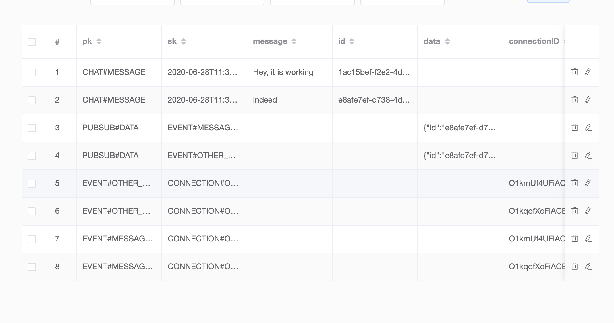

# Graphql APIGW API

This is an example of a working `graphql` API (with `subscriptions`)
which is purely serverless 🔥

## Technologies

I've written this example using golang. The when it comes to the infrastructure:

- DynamoDB (with streams for `pubSub` like behavior)
- API Gateway (websocket and REST API)

## Dynamo table structure

I've managed to fit everything into 1 table.

It uses a generic PK and SK for overloading and has `GSI` on `connectionID`(sparse index) for the deletion purposes.

## Deployment

Make sur you have [serverless framework](https://github.com/serverless/serverless) installed.

Next, make sure that the values within the `serverless.yml` are correct. Mainly `region` one.

Then, simply run these 2 commands

- `npm install`
- `sls deploy`

## Word of caution

This should be used as an example not something that you ship yourself.
I did not write any tests and there is no exponential backoff for `bachWriteItem`.

Saying that, I think this is a good starting point for someone who does not want to use `amplify`.

